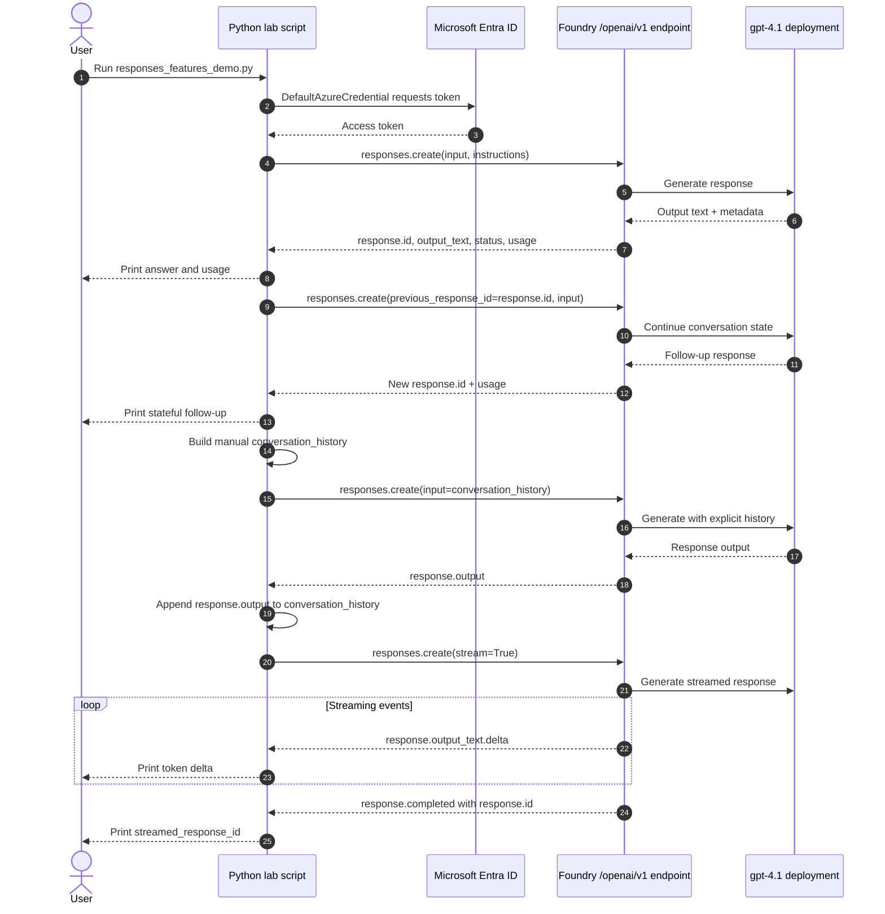

# Responses API flow

Key idea: `previous_response_id` lets the service carry conversation state, while manual history gives the app explicit control over what context is sent. Streaming returns text incrementally and still produces a final response ID when the response completes.
